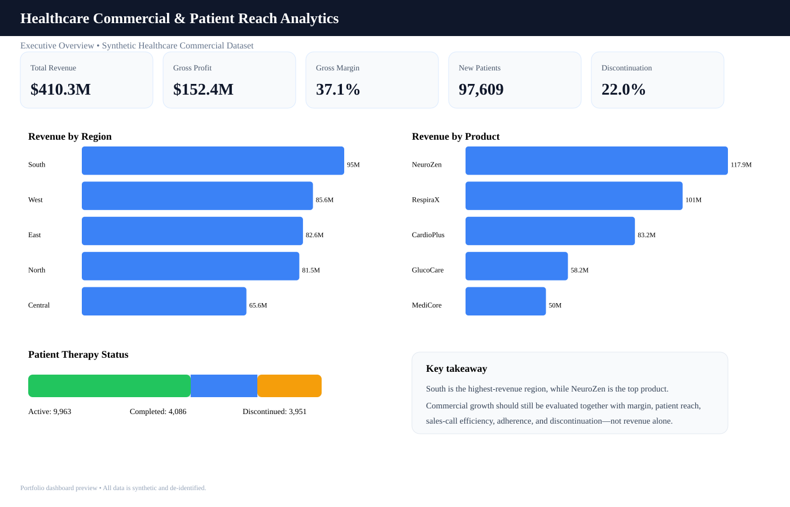
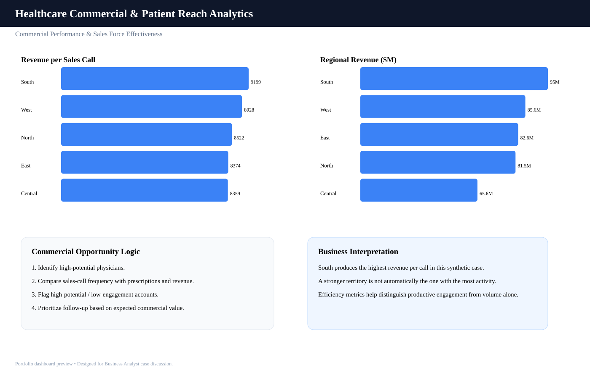
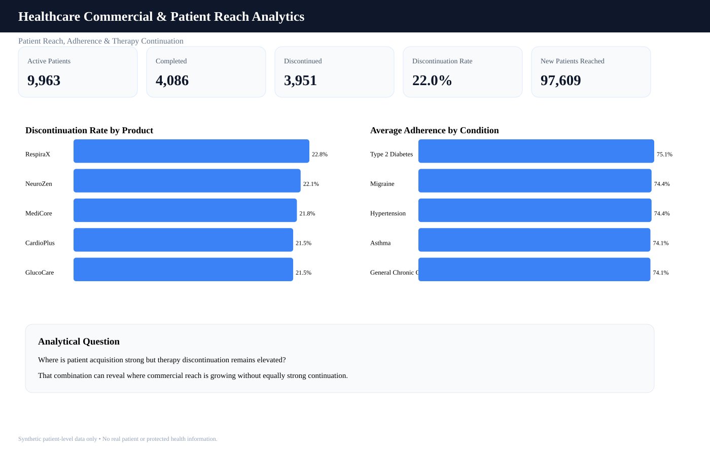

# Healthcare Commercial & Patient Reach Analytics

## Project Summary
A portfolio-ready Business Analyst project that evaluates pharmaceutical commercial performance and patient reach using SQL, Python, and Power BI.

The dataset in this repository is **fully synthetic and de-identified**. It contains no real patient identities or protected health information.

## Dashboard Preview

### Executive Overview


### Commercial Performance & Sales Force Effectiveness


### Patient Reach, Adherence & Therapy Continuation


> The images above are portfolio dashboard previews generated from the synthetic project data. The repository also includes a detailed Power BI build guide and DAX measures for recreating the interactive report in Power BI Desktop.

## Key Portfolio KPIs
- **Total Revenue:** $410.3M
- **Gross Profit:** $152.4M
- **Gross Margin:** 37.1%
- **New Patients Reached:** 97,609
- **Therapy Discontinuation Rate:** 22.0%

## Business Questions
1. Which regions and products drive revenue and gross profit?
2. Where is patient reach strongest or weakest?
3. Which high-potential doctors are under-engaged?
4. How effective are sales calls in generating prescriptions and revenue?
5. Which products have high discontinuation or lower adherence?
6. Which sales representatives need support?
7. Where should the commercial team prioritize next-quarter effort?

## Dataset
- `commercial_sales.csv`: doctor-product-month commercial activity
- `doctors.csv`: specialty, geography, potential segment and patient volume
- `sales_reps.csv`: representative-to-region mapping
- `products.csv`: therapy area, price and expected margin
- `patient_reach.csv`: synthetic patient journey, therapy status and adherence

Generated rows:
- Commercial sales: 9,846
- Doctors: 350
- Sales reps: 25
- Synthetic patients: 18,000

## Tools
- **SQL:** MySQL 8+, joins, CTEs, aggregations, LAG, DENSE_RANK
- **Python:** Pandas, NumPy, Matplotlib
- **Power BI:** Power Query, data modeling, DAX, interactive dashboard design
- **Git/GitHub:** version control and portfolio documentation

## Analysis Highlights
- Compared revenue, prescriptions, margin, and patient reach across regions and products.
- Measured sales-force effectiveness using revenue per call and prescriptions per call.
- Identified high-potential physicians with relatively low commercial engagement.
- Evaluated patient adherence and therapy discontinuation by product and condition.
- Connected commercial performance with patient-reach metrics to support business recommendations.

## Recommended Workflow
1. Run `python/generate_synthetic_data.py` to recreate the full raw dataset.
2. Run `python/healthcare_eda.py` for exploratory analysis and processed outputs.
3. Load the generated tables into MySQL.
4. Run the SQL analysis queries.
5. Import the tables into Power BI.
6. Build the interactive dashboard using `powerbi/powerbi_build_guide.md`.
7. Use the dashboard findings to write evidence-backed commercial recommendations.

## Star Schema
- Fact: `commercial_sales`
- Dimensions: `doctors`, `products`, `sales_reps`, Date
- Patient fact: `patient_reach`

## Repository Structure
```text
data/
  README.md
python/
  generate_synthetic_data.py
  healthcare_eda.py
sql/
  01_schema.sql
  02_analysis_queries.sql
powerbi/
  powerbi_build_guide.md
docs/
  dashboard/
    executive_overview.svg
    commercial_performance.svg
    patient_reach.svg
  interview_guide.md
  resume_bullets.md
README.md
requirements.txt
```

## Resume Project Title
**Healthcare Commercial & Patient Reach Analytics | Python, SQL, Power BI**

> This is a synthetic commercial healthcare analytics case study, not real patient or company data.
