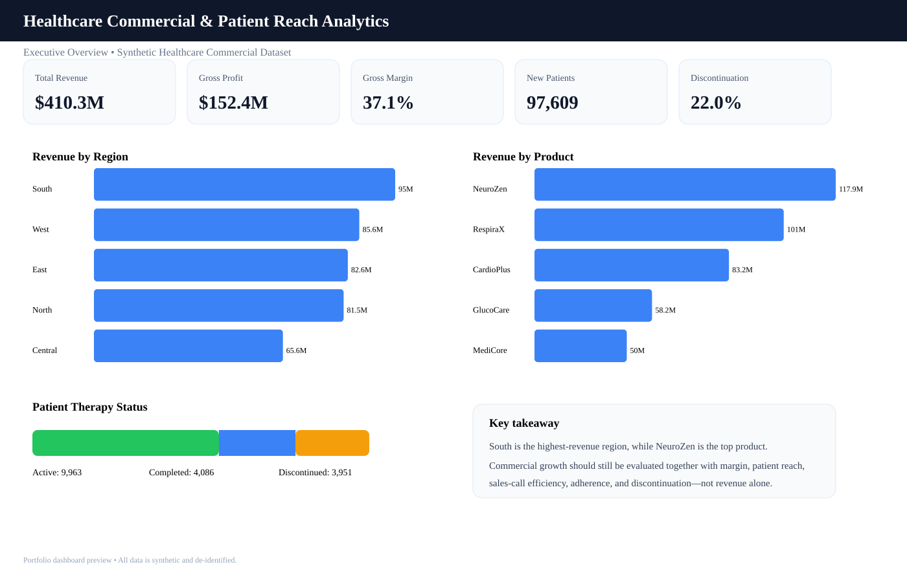
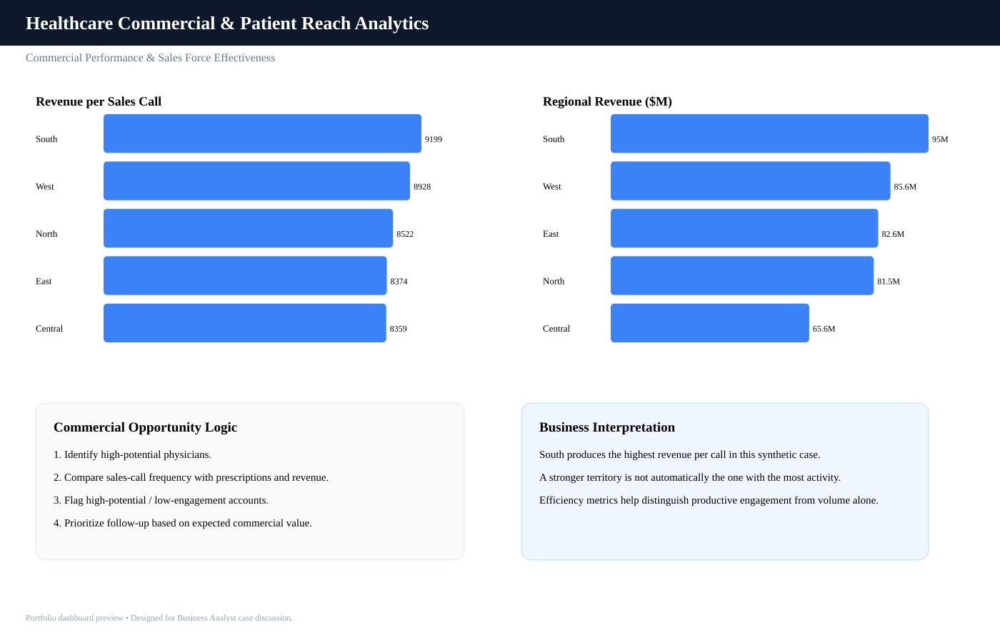
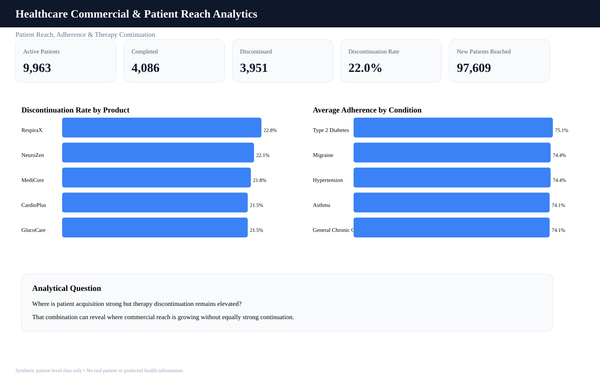

# Healthcare Commercial & Patient Reach Analytics

## Project Summary
A portfolio-ready Business Analyst project that evaluates pharmaceutical commercial performance and patient reach using SQL, Python, and Power BI.

The datasets are **entirely synthetic**, not de-identified extracts of actual patient records. They contain no real patient identities or protected health information.

## Dashboard Preview

### Executive Overview


### Commercial Performance & Sales Force Effectiveness


### Patient Reach, Adherence & Therapy Continuation


> The images above are portfolio dashboard previews generated from the synthetic project data. The repository includes a Power BI build guide and sample DAX measures; **no verified runnable `.pbix` file is included**. The SVG previews are illustrative snapshots, not an interactive published Power BI report.

## Key Portfolio KPIs

Fixed-seed results from the latest regenerated synthetic dataset; metrics represent a fictional simulation, not observed business or clinical outcomes.
- **Total Revenue:** 410.70 million simulated monetary units (no real-world currency assigned)
- **Gross Profit:** 152.70 million simulated monetary units
- **Gross Margin:** 37.18%
- **Summed new-patient events in commercial records:** 97,624 (not a count of distinct patients)
- **Simulated therapy discontinuation rate:** 21.94%

## Business Questions
1. Which regions and products drive revenue and gross profit?
2. Where is patient reach strongest or weakest?
3. Which high-potential doctors are under-engaged?
4. How effective are sales calls in generating prescriptions and revenue?
5. Which products have high discontinuation or lower adherence?
6. Which sales representatives need support?
7. Where should the commercial team prioritize next-quarter effort?

## Dataset
- `commercial_sales.csv`: doctor-product-month commercial activity
- `doctors.csv`: specialty, geography, potential segment and patient volume
- `sales_reps.csv`: representative-to-region mapping
- `products.csv`: therapy area, price and expected margin
- `patient_reach.csv`: synthetic patient journey, therapy status and adherence

Generated rows:
- Commercial sales: 9,816
- Doctors: 350
- Sales reps: 25
- Synthetic patients: 18,000

## Tools
- **SQL:** MySQL 8+, joins, CTEs, aggregations, LAG, DENSE_RANK
- **Python:** Pandas, NumPy, Matplotlib
- **Power BI:** Power Query, data modeling and illustrative DAX/dashboard design guide
- **Git/GitHub:** version control and portfolio documentation

## Analysis Highlights
- Compared revenue, prescriptions, margin, and patient reach across regions and products.
- Measured sales-force effectiveness using revenue per call and prescriptions per call.
- Identified high-potential physicians with relatively low commercial engagement.
- Evaluated patient adherence and therapy discontinuation by product and condition.
- Connected commercial performance with patient-reach metrics to support business recommendations.

## Recommended Workflow
1. Run `python/generate_synthetic_data.py` to recreate the full raw dataset.
2. Run `python/healthcare_eda.py` for exploratory analysis and processed outputs.
3. Load the generated tables into MySQL.
4. Run the SQL analysis queries.
5. Import the tables into Power BI.
6. Build the interactive dashboard using `powerbi/powerbi_build_guide.md`.
7. Use the dashboard findings to write evidence-backed commercial recommendations.

## Star Schema
- Fact: `commercial_sales`
- Dimensions: `doctors`, `products`, `sales_reps`, Date
- Patient fact: `patient_reach`

## Repository Structure
```text
data/
  README.md
python/
  generate_synthetic_data.py
  healthcare_eda.py
sql/
  01_schema.sql
  02_analysis_queries.sql
powerbi/
  powerbi_build_guide.md
docs/
  dashboard/
    executive_overview.svg
    commercial_performance.svg
    patient_reach.svg
  interview_guide.md
  resume_bullets.md
README.md
requirements.txt
```

## Resume Project Title
**Healthcare Commercial & Patient Reach Analytics | Python, SQL, Power BI**

> This is a synthetic commercial healthcare analytics case study, not real patient or company data.


## Management Consulting Layer

To extend the analytics work beyond dashboarding, this repository now includes a consulting-style decision layer focused on commercial prioritization.

- `consulting_case/commercial_strategy_memo.md` — executive-style recommendation memo
- `consulting_case/case_interview_defense.md` — structured explanation for consulting interviews
- `consulting_case/resume_bullets.md` — concise, defensible resume bullets

### Consulting Problem Statement
How should a healthcare commercial team prioritize products, regions, physician engagement, and patient-continuation initiatives when resources are limited?

### Decision Framework
1. **Market attractiveness:** patient reach, growth potential, therapy demand
2. **Commercial performance:** revenue, gross profit, margin
3. **Channel effectiveness:** physician engagement and sales-force productivity
4. **Patient continuity:** adherence and discontinuation signals
5. **Execution:** actions ranked by expected impact and ease of implementation

This remains a **synthetic, de-identified portfolio case**. The recommendations demonstrate structured problem solving and do not represent advice to a real healthcare company.
